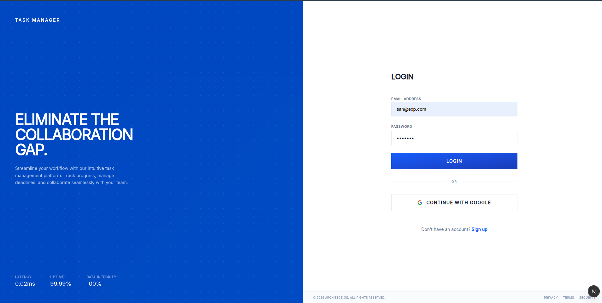
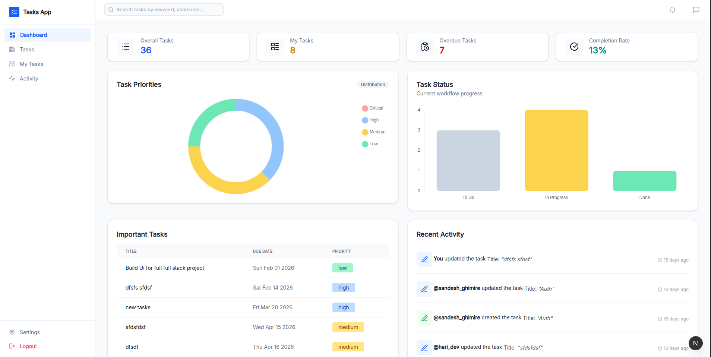
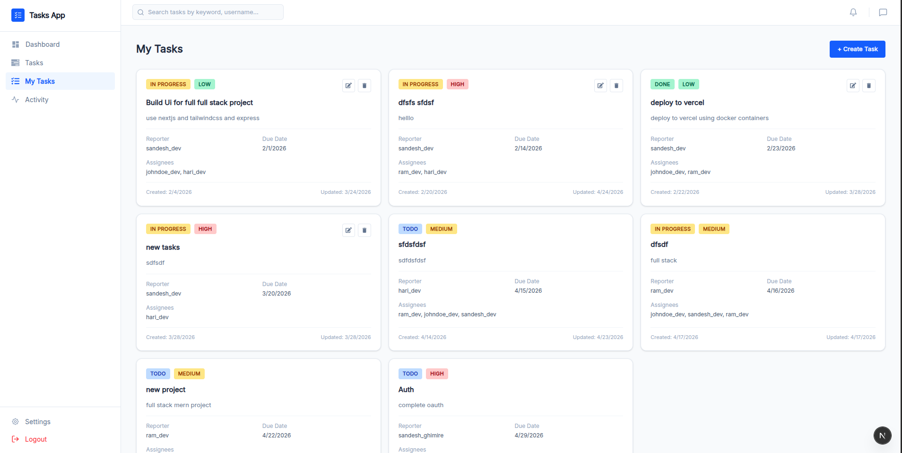
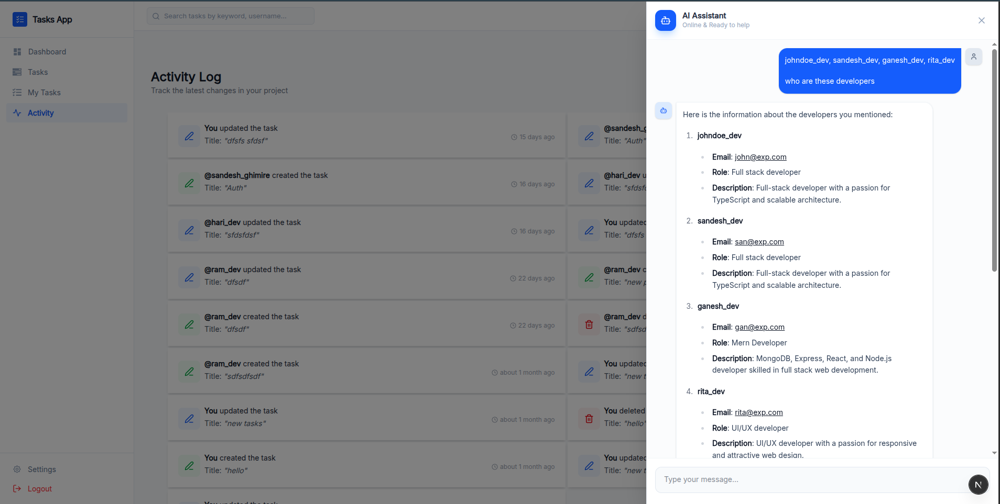
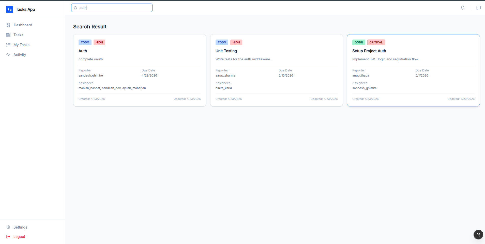
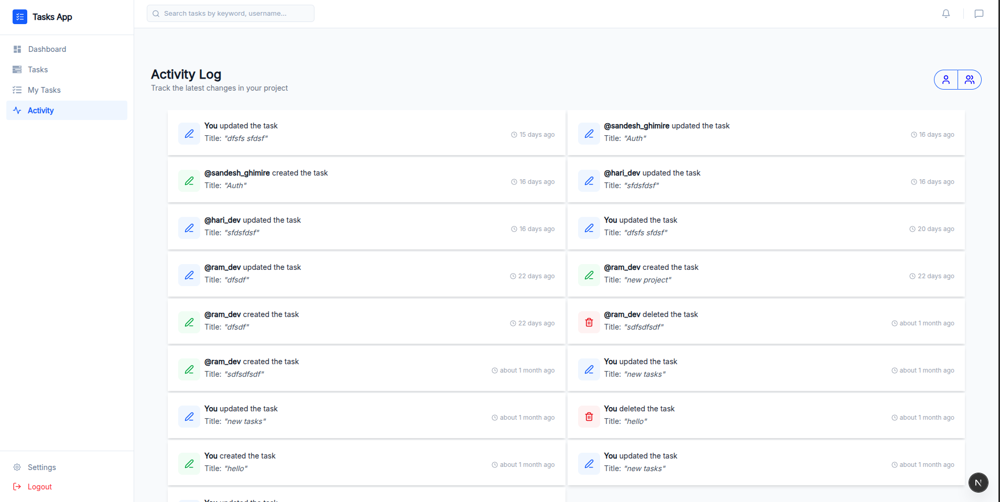

# 🗂️ Collaborative Task Management System

> A full-stack collaborative platform that enables teams to assign, track, and update tasks , secured with OAuth and JWT.

---

## 📋 Table of Contents

- [Description](#-description)
- [Key Features](#-key-features)
- [Tech Stack](#-tech-stack)
- [Screenshots](#-screenshots)

---

## 📖 Description

CollabTask is a real-time task management platform built for teams that need to collaborate without friction. Multiple users can create, assign, and update tasks simultaneously, with activities reflected instantly across all connected clients via WebSockets.

The platform integrates an AI assistant powered by OpenAI that answers contextual questions about tasks, recent activity, and team members — right within the app. Authentication is handled securely through Google OAuth 2.0 and JWT, and a powerful search system lets users find tasks and teammates by keyword or username. A personal dashboard gives each user a bird's-eye view of their workload using aggregated data from MongoDB.

---

## ✨ Key Features

- **Collaboration** — Multiple users can view and update tasks simultaneously with instant activity updates via Socket.io
- **AI Assistant** — An embedded OpenAI-powered chatbot provides contextual answers about tasks and users
- **Auto Assign Task** - LLM helps to automatically assign Task to multiple users by looking at Task description.
- **Google OAuth 2.0 + JWT Authentication** — Secure login with Google accounts; sessions protected with JWT across different endpoints
- **Rate Limiting** — Brute-force protection on failed login attempts and \on AI Assistant requests to prevent misuse
- **Search Task** — Keyword and username-based search using Mongoose queries and Regex for fast, flexible results
- **User Dashboard** — Personalized overview of task progress and stats built with MongoDB Aggregation Pipeline and Chart.js
---

## 🛠️ Tech Stack

### Frontend
| Technology | Purpose |
|---|---|
| React | UI framework |
| Zustand | Lightweight global state management |
| Socket.io-client | Real-time WebSocket communication |
| React-chartjs-2 | Dashboard charts and data visualization |

### Backend
| Technology | Purpose |
|---|---|
| Express | REST API server |
| Socket.io | WebSocket server for real-time events |
| Passport.js | Authentication middleware |
| Google OAuth 2.0 | Social login provider |
| JWT (JSON Web Tokens) | Session management and route protection |
| OpenAI API | AI assistant integration |
| Zod | Request validation and schema enforcement |

### Database
| Technology | Purpose |
|---|---|
| MongoDB | Primary database |
| Mongoose | ODM for schema modeling and queries |

---

## 📸 Screenshots
### Login

### Dashboard

### Task Board

### AI Assistant

### Search

### Activity

